# SITE-SITE-IKEv1-POLICY-BASED

> **Autor:** Randy Nin **|**
> **Laboratorio de Redes | GNS3**

Implementación completa de una VPN Site-to-Site IPSec IKEv1 en modalidad Policy-Based sobre Cisco IOS. El tunnel protege el tráfico entre dos LANs privadas a través de una red pública simulada, usando AES-256 para cifrado y SHA-256 para integridad en ambas fases de negociación.

---

## Contenido del repositorio

```
SITE-SITE-IKEv1-POLICY-BASED/
├── IMG/
│   ├── topology.png
│   ├── before-vpn-ping.png
│   ├── wireshark-isakmp-quickmode-esp.png
│   ├── wireshark-esp-detail.png
│   ├── after-vpn-ping.png
│   ├── sitea-interface-brief.png
│   ├── siteb-interface-brief.png
│   ├── sitea-isakmp-sa.png
│   ├── siteb-isakmp-sa.png
│   ├── sitea-ipsec-sa.png
│   └── siteb-ipsec-sa.png
├── Documentación Tecnica Profesional VPN Site-to-Site - IPSec IKEv1 - Policy-Based (Randy Nin -- 2025-0660).pdf
├── Policy-Based
└── README.md
```

---

## Documentación técnica

La documentación técnica completa está disponible en:

**[Documentación Tecnica Profesional VPN Site-to-Site - IPSec IKEv1 - Policy-Based (Randy Nin -- 2025-0660).pdf](./Documentación%20Tecnica%20Profesional%20VPN%20Site-to-Site%20-%20IPSec%20IKEv1%20-%20Policy-Based%20(Randy%20Nin%20--%202025-0660).pdf)**

---

## Topología

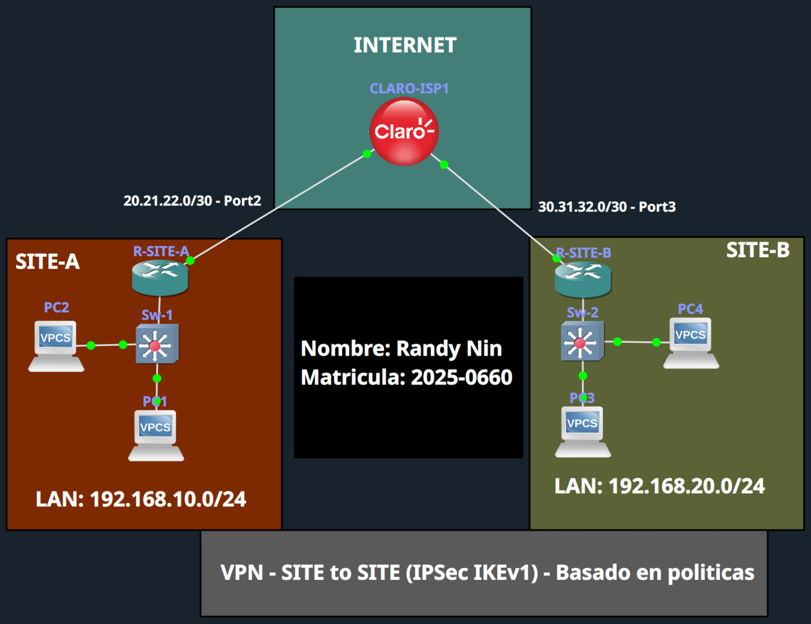

| Dispositivo | Interfaz | IP | Rol |
|:---|:---|:---|:---|
| CLARO-ISP | Gi0/1 | 20.21.22.2/30 | Enlace hacia SITE-A |
| CLARO-ISP | Gi0/2 | 30.31.32.2/30 | Enlace hacia SITE-B |
| R-SITE-A | Gi0/0 | 192.168.10.1/24 | Gateway LAN SITE-A |
| R-SITE-A | Gi0/1 | 20.21.22.1/30 | WAN / VPN endpoint |
| R-SITE-B | Gi0/0 | 192.168.20.1/24 | Gateway LAN SITE-B |
| R-SITE-B | Gi0/2 | 30.31.32.1/30 | WAN / VPN endpoint |

---

## Interfaces verificadas

**R-SITE-A:**

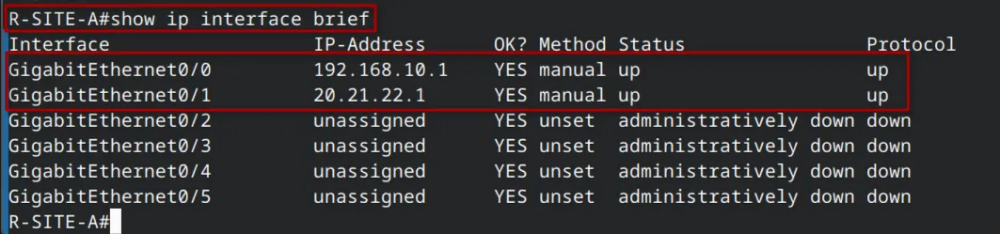

**R-SITE-B:**

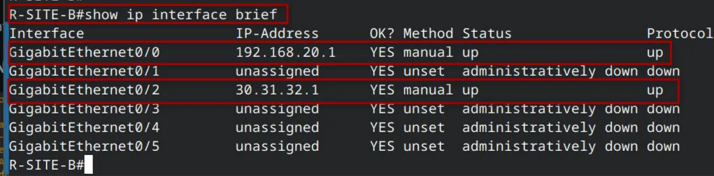

---

## Configuración VPN

El archivo de configuración completo está disponible en [`Policy-Based`](./Policy-Based). A continuación, los bloques clave:

**Fase 1: política ISAKMP (simétrica en ambos routers)**

```
crypto isakmp policy 10
 encryption aes 256
 hash sha256
 authentication pre-share
 group 14
 lifetime 86400

! En R-SITE-A:
crypto isakmp key randy123 address 30.31.32.1

! En R-SITE-B:
crypto isakmp key randy123 address 20.21.22.1
```

**Fase 2: transform-set (simétrico en ambos routers)**

```
crypto ipsec transform-set TRANF_SET esp-aes 256 esp-sha256-hmac
 mode tunnel
```

**ACL de tráfico interesante + crypto map**

```
! En R-SITE-A:
ip access-list extended VPN_to_SITEA
 permit ip 192.168.10.0 0.0.0.255 192.168.20.0 0.0.0.255

crypto map CMAP_SITEA 10 ipsec-isakmp
 set peer 30.31.32.1
 set transform-set TRANF_SET
 set pfs group14
 match address VPN_to_SITEA

interface GigabitEthernet0/1
 crypto map CMAP_SITEA

! En R-SITE-B:
ip access-list extended VPN_to_SITEB
 permit ip 192.168.20.0 0.0.0.255 192.168.10.0 0.0.0.255

crypto map CMAP_SITEB 10 ipsec-isakmp
 set peer 20.21.22.1
 set transform-set TRANF_SET
 set pfs group14
 match address VPN_to_SITEB

interface GigabitEthernet0/2
 crypto map CMAP_SITEB
```

---

## Antes de la VPN: sin conectividad

Sin el tunnel configurado, los hosts de ambas LANs no pueden comunicarse. El tráfico entre redes privadas no tiene ruta a través del ISP.

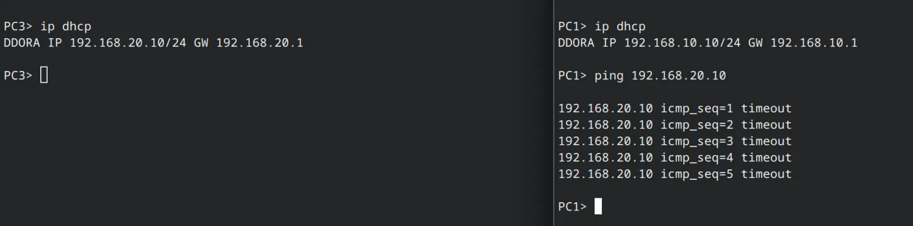

---

## Negociación IKEv1

Al generarse tráfico interesante, los routers negocian automáticamente el tunnel. Wireshark confirma los **9 mensajes totales**: 6 de Fase 1 en Main Mode y 3 de Fase 2 en Quick Mode.

**Fase 1: 6 mensajes Identity Protection (Main Mode)** y **Fase 2: 3 mensajes Quick Mode + inicio de tráfico ESP**


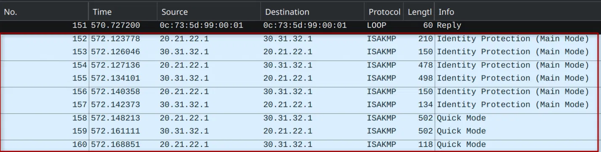

---

## Tráfico cifrado con ESP

Una vez establecido el tunnel, el tráfico entre LANs viaja completamente cifrado. Wireshark solo puede ver la cabecera IP externa (IPs WAN de los routers) y el bloque ESP opaco. El payload original es inaccesible sin las claves.

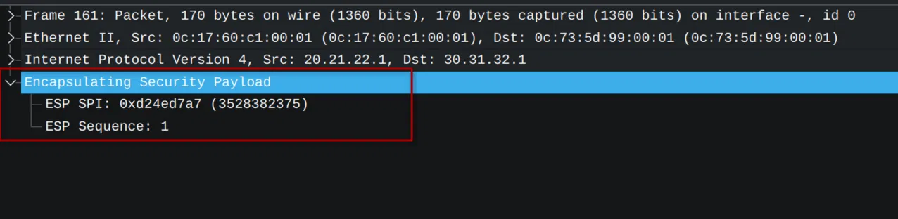

---

## Conectividad establecida

Con el tunnel activo, los hosts de ambas LANs se comunican correctamente. El primer ping puede tener timeout durante la negociación inicial.

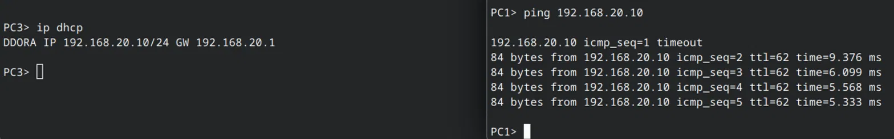

---

## Verificación del tunnel

### show crypto isakmp sa

Confirma que la SA de Fase 1 está activa (`QM_IDLE` es el estado operacional normal).

**R-SITE-A:**

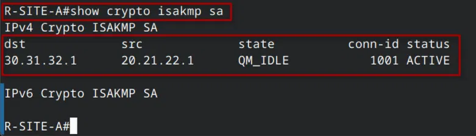

**R-SITE-B:**

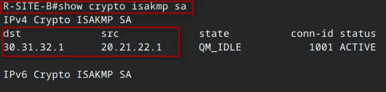

---

### show crypto ipsec sa

Confirma que las SAs de Fase 2 están activas y el tráfico fluye en ambas direcciones sin errores. Los SPIs son complementarios entre ambos extremos.

**R-SITE-A:**

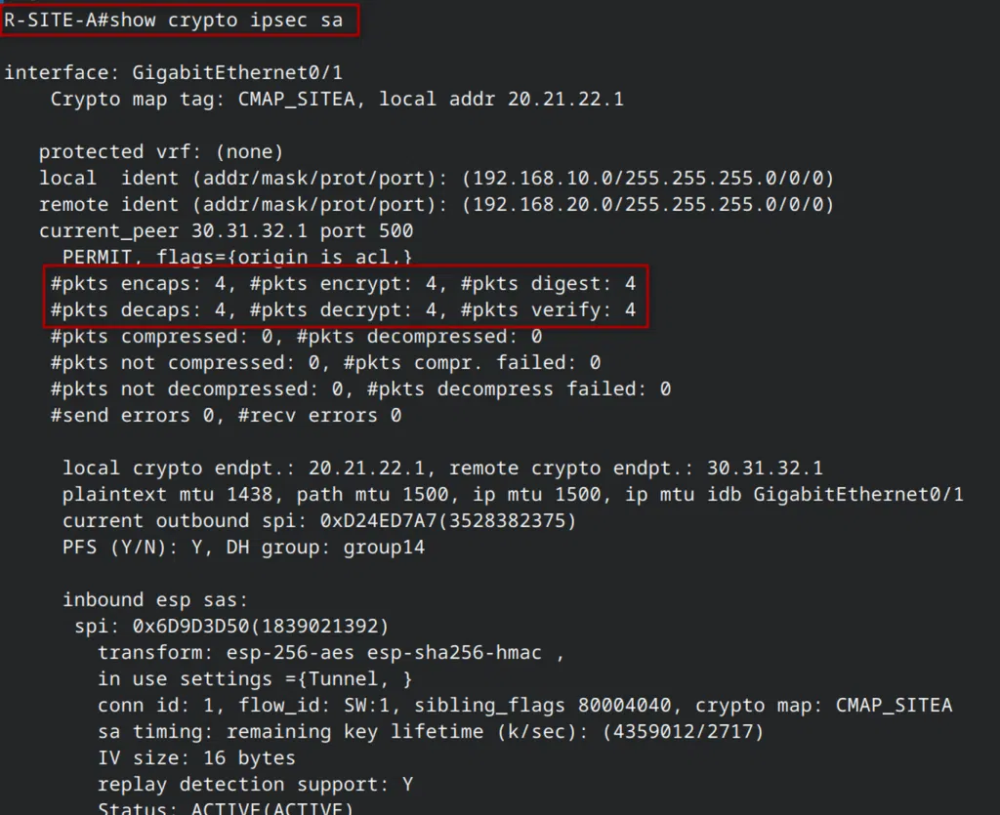

**R-SITE-B:**

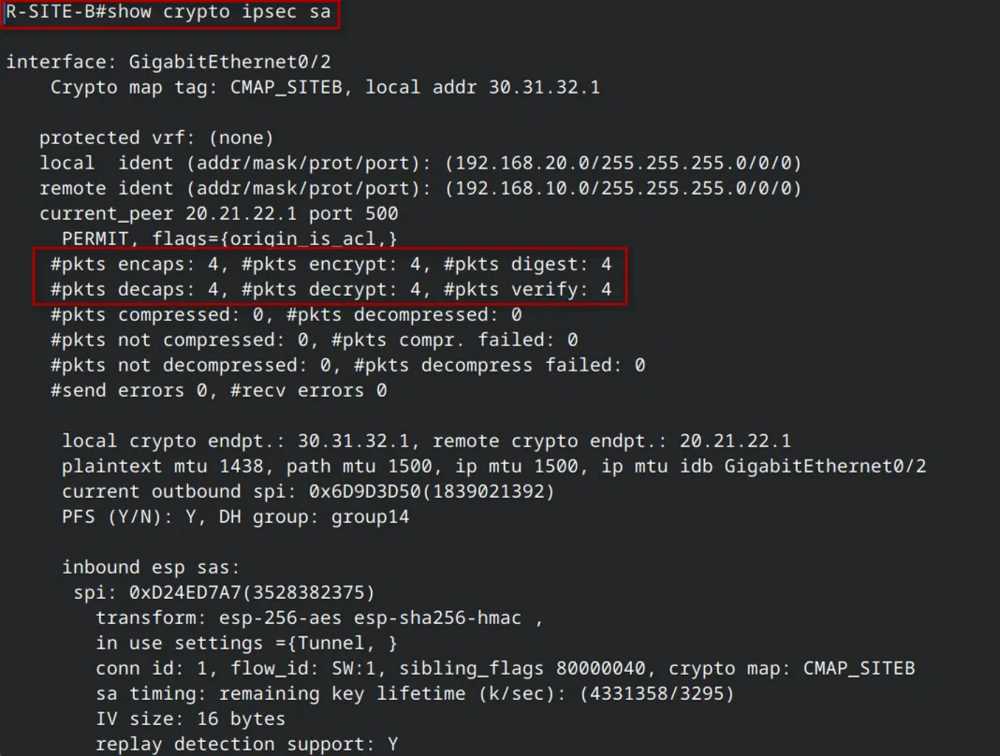

| Contador | R-SITE-A | R-SITE-B |
|:---|:---:|:---:|
| encaps / encrypt / digest | 4 / 4 / 4 | 4 / 4 / 4 |
| decaps / decrypt / verify | 4 / 4 / 4 | 4 / 4 / 4 |
| send errors / recv errors | 0 / 0 | 0 / 0 |

---

## Video demostrativo

**Link:** [https://youtu.be/dk0Ibz2eTqI](https://youtu.be/dk0Ibz2eTqI)

---

*Randy Nin / Matrícula 2025-0660*

---
